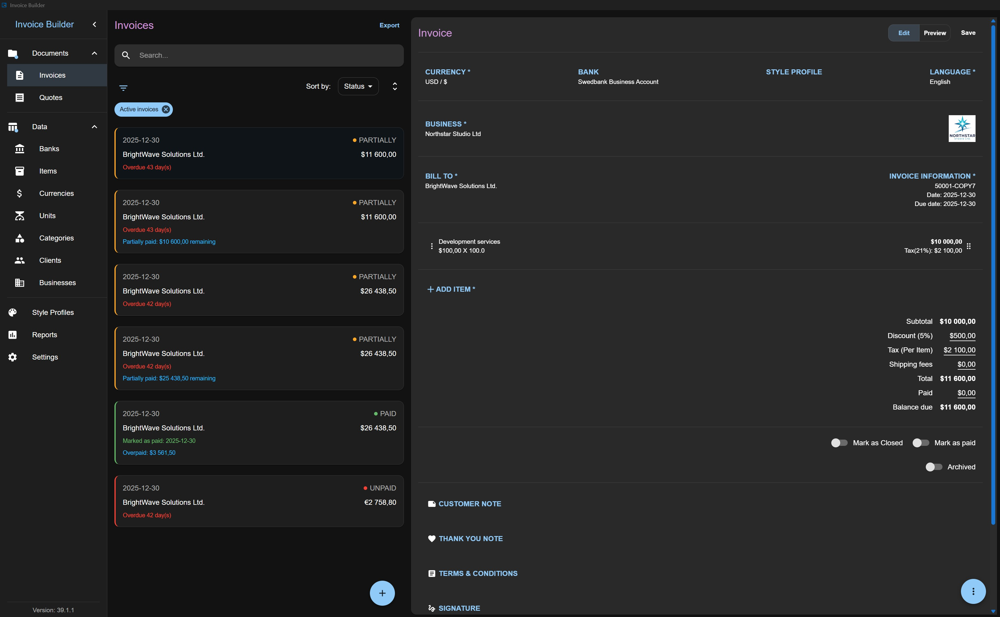
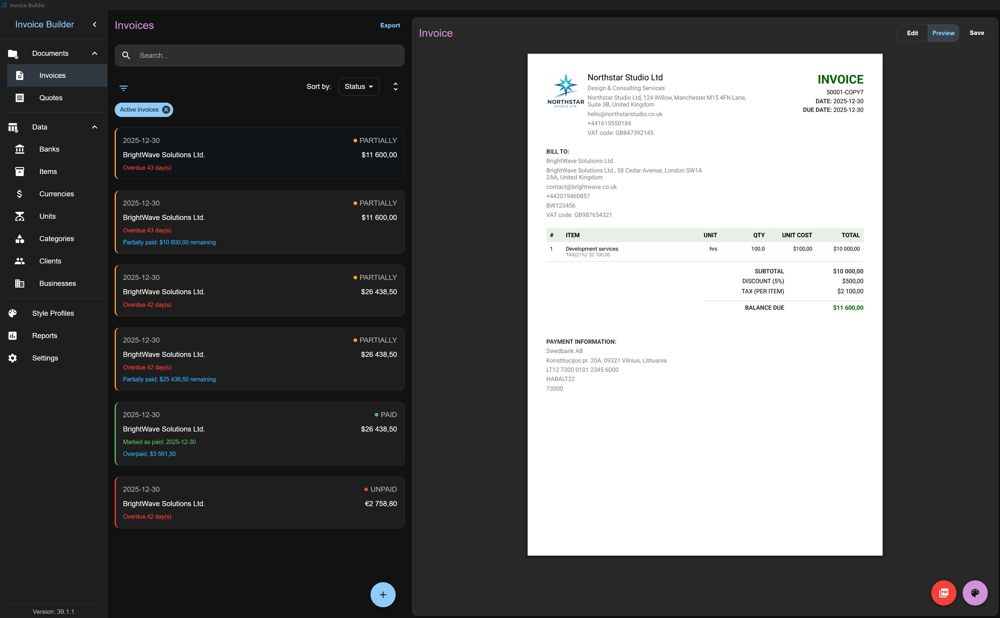
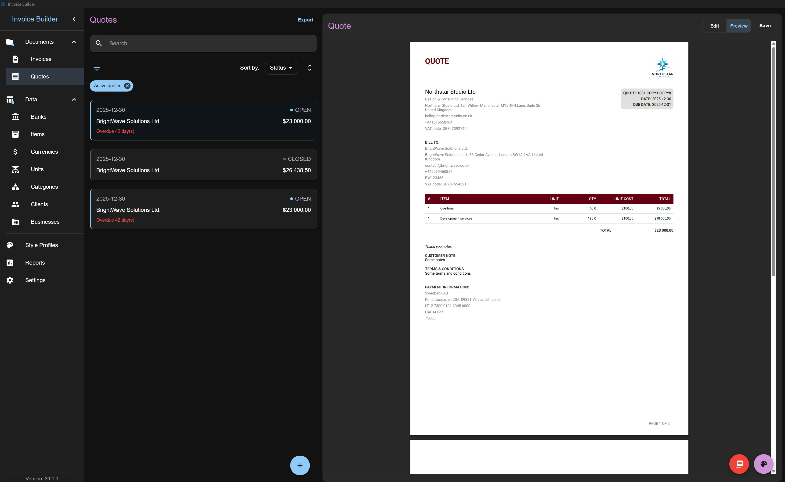
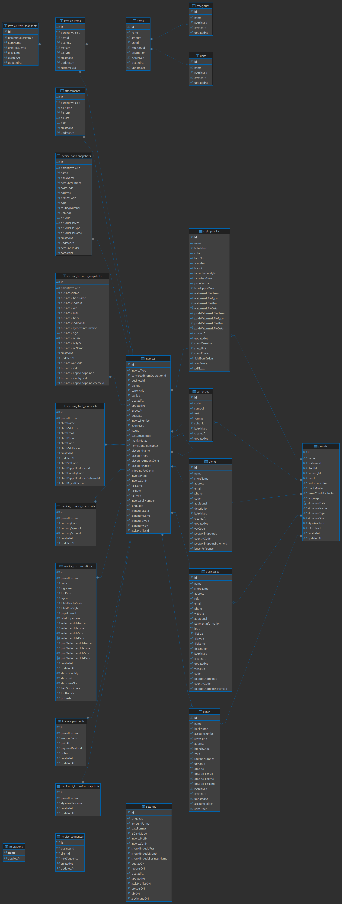

# Invoice Builder

[](LICENSE)
[](https://github.com/piratuks/invoice-builder/releases)
[](https://github.com/piratuks/invoice-builder/releases)


[](https://github.com/piratuks/invoice-builder/pkgs/container/invoice-builder)
[](https://www.buymeacoffee.com/evaldizi)

**Offline invoicing with full data ownership.**

**Invoice Builder** is an **offline-first, open-source invoicing and quoting application** for freelancers and small businesses who want full control over their data.

No accounts. No cloud. No subscriptions.  
Your data stays on your machine in a database file you own.

## 📸 Screenshots





## ❓ Why Invoice Builder?

Invoice Builder is designed for freelancers, contractors, and small businesses who want:

- **Full ownership of their data** - no cloud lock‑in
- **Offline access** - works anywhere, anytime
- **A predictable, transparent tool** - no subscriptions, no hidden sync
- **Cross-platform support** - macOS, Windows & Linux
- **Import/export freedom** - JSON, XLSX, full database backups
- **Highly customizable PDFs** - branding, layout, colors, typography
- **UBL & Peppol BIS 3.0 support** – generate invoices that are compliant with European e-invoicing standards for automatic submission to buyers and public administrations

If you value **privacy, portability, and control**, this app is built for you.

## ✨ Key Features

### Core

- Create and manage **Invoices** and **Quotes**
- Offline-first: works without internet
- Database-file based (create or open a database anywhere)
- Automatic snapshotting of business, bank, style profile, client, item, and currency data per invoice/quote
- Multi-currency support: choose the currency for each invoice/quote individually
- Responsive layout - usable on small and large screens, resizable windows supported
- Invoice/Quote translations – select a language per document, independent of app settings
- Export invoices in UBL 2.1 / Peppol BIS Billing 3.0 XML format, fully compliant for automated e-invoicing
- Export invoices in XRechnung (UBL 2.1) XML format, fully compliant for automated e-invoicing

### Business Data Management

- Banks, Businesses, Clients, Items, Categories, Units, Currencies
- Persistent search, persistent sort, persistent filter, archive (non-destructive)
- XLSX import/export for most entities
- Automatic creation of missing units/categories on item import

### Financial Flexibility

- Fixed or percentage discounts
- Shipping fees
- Tax:
  - inclusive or exclusive
  - per-item or on total
  - deducted tax
- Partial payments, balance due tracking
- Invoice states: unpaid, partially paid, paid, closed
- Quote states: open, closed

### PDF Generation & Customization

- Live PDF preview
- A4 / Letter formats
- Layout presets
- Color, font size, font family (Supported fonts: Helvetica, Times-Roman, Courier, Roboto, Inter), logo size customization
- Table header & row styles
- Uppercase label toggle
- Quote & invoice watermarks (including paid watermark)
- Attachments: include images in PDFs
- Signature support: upload or hand-draw signatures and apply them to PDFs
- Style profiles are now available for invoices and quotes, enabling quick, consistent theming
- Show quantity, unit, and row number in the PDF item table
- Custom header sections and custom values in the PDF item table
- Ability to reorder all columns/headers in the PDF item table
- Ability to include QR codes for payment into PDF
- Ability to customize invoice / quote labels to custom text

### Reports

- Aggregated data
- Charts and summaries

### Import, Export & Backup

- Full database backup & restore
- Export all data to JSON and import back
- Export to XLSX for most entities
- Invoices and quotes support export (historical documents remain immutable)

### Settings & Customization

- Language selection: currently French, German, English and Lithuanian
- Number & date formatting (e.g. `1,234.10` vs `1.234,10`)
- Invoice/quote number prefix & suffix
- File name customization for exported PDFs
- Light & dark mode
- Enable/disable UBL 2.1 Peppol BIS Billing 3.0, reports, style profiles, presets and quotes
- Check for updates via GitHub releases
- Presets: Predefine default Invoice/Quote data (e.g., business, client, currency, bank, style profile, notes, language, signature) to streamline document creation

## 🖥️ Supported Platforms

- **Windows:** 10 or newer, 64-bit
- **Linux:** any modern distribution (Ubuntu, Debian, Linux Mint, etc.) supporting .deb packages
- **macOS:** 11.0 (Big Sur) or newer, Apple Silicon (M1/M2/M3/M4), 64-bit, .dmg installer available
- **Memory:** 2 GB RAM minimum (1 GB may work for very small datasets)
- **Disk space:** ~200 MB for the installer; ~550mb for the app; additional space needed for database files

## 🐘 PostgreSQL Support

Invoice Builder now supports **two database backends**:

| Storage Type            | Description                                                           | Best For                                           |
| ----------------------- | --------------------------------------------------------------------- | -------------------------------------------------- |
| **SQLite (local file)** | Simple, portable, zero‑configuration database stored as a single file | Solo users, offline use, desktop mode              |
| **PostgreSQL (server)** | Network‑accessible database server with concurrency and robustness    | Multi‑user setups, Docker deployments, NAS/servers |

Users can now choose between:

- **Creating or opening a local SQLite database file**, or
- **Connecting to a PostgreSQL server** by entering host, port, username, password, and database name.

This makes Invoice Builder flexible for both lightweight personal use and more advanced multi‑device or multi‑user environments.

## 🧑‍💻 Self-Hosting (Docker)

Invoice Builder can also be self-hosted using Docker for users who prefer running it on their own server or NAS.

This option is ideal if you want:

- Centralized access from multiple machines
- Easy backups via mounted volumes

### Docker Image

A pre-built image is published automatically to GitHub Container Registry on every push to `main` and on every version tag:

```bash
ghcr.io/piratuks/invoice-builder:latest
```

Pull it at any time with:

```bash
docker pull ghcr.io/piratuks/invoice-builder:latest
```

> **ℹ️ `VITE_API_URL` is no longer needed for Docker deployments.**
> The Docker image now uses **nginx** as the frontend server. Nginx proxies all `/api/*` requests
> to the backend internally, so the frontend never needs to know the backend's external address.
> `VITE_API_URL` is only needed when running the web server outside Docker (e.g. `npm run dev:react`, `npm run dev:webserver`).
>
> If you build the image yourself for non-Docker use, you can still pass it:
>
> ```bash
> docker build --build-arg VITE_API_URL=http://your-host:3000 -t invoice-builder .
> ```
>
> But for all standard Docker deployments you can omit it entirely.

---

### Option A – Two containers (recommended)

The default setup runs backend and frontend as separate containers from the same image.

```bash
docker compose pull
docker compose up -d
```

| Container  | Port | Role                         |
| ---------- | ---- | ---------------------------- |
| `backend`  | 3000 | Node.js REST API + SQLite/PG |
| `frontend` | 3001 | Static SPA served by `serve` |

---

### Option B – Single container

Run both backend and frontend in one container using `SERVICE=all`:

```bash
docker compose -f docker-compose.standalone.yml up -d
```

| Port | Role                         |
| ---- | ---------------------------- |
| 3000 | Node.js REST API + SQLite/PG |
| 3001 | Static SPA served by `serve` |

---

### Building locally instead of pulling

If you prefer to build the image from source:

```bash
# Two-container build
docker compose up -d --build
docker compose up -d

# Or single container
docker build -t invoice-builder .
docker compose -f docker-compose.standalone.yml up -d
```

## 📦 Installation

Download the latest release from the **GitHub Releases** page:

➡️ [Download Latest Release](https://github.com/piratuks/invoice-builder/releases)

No account required.

> ⚠️ **Browser download warning**
>
> When downloading the app, your browser may show a message like:
>
> - “This file is from an unknown source”
> - “This file is rarely downloaded”
>
> This is normal for newly published apps and does **not** indicate a security issue.  
> Simply choose **Keep anyway / Save anyway** to proceed with the download.
> 🐧 **Linux package warning**
>
> On some Linux distributions (Ubuntu, Linux Mint, etc.), you may see messages such as:
>
> - “This package is provided by a third party”
> - “Installing software from outside the official repositories may be unsafe”
>
> This warning appears because the app is not distributed via the default system repositories.  
> If you downloaded the package directly from the official GitHub Releases page, it is safe to proceed.
> 🍎 **macOS Gatekeeper warning**
>
> Because this app is **unsigned**, macOS may display a message like:
>
> - “App is damaged and can’t be opened. Move to Trash”
> - “App is from an unidentified developer”
>
> This happens because macOS Gatekeeper treats all unsigned apps downloaded from the internet as potentially unsafe.  
> It adds a special **quarantine flag** to the app bundle, which prevents it from launching.
>
> To fix this, after downloading and installing it:
>
> 1. Open **Terminal**.
> 2. Run the following command:
>
>    ```bash
>     sudo xattr -rd com.apple.quarantine "/Applications/Invoice Builder.app"
>    ```

## 🚀 Quick Start

1. Launch the application
2. Create a new database file or open an existing one
3. Add at least:
   - a Business
   - a Currency
   - a Client
   - a Bank
   - an Item
4. Create your first Invoice or Quote
5. Preview and export to PDF

## 📘 Tutorial

Detailed tutorials and usage guides are available here: [TUTORIAL](TUTORIAL.md)

## 🧠 Data Model & Snapshots

When an invoice or quote is created, snapshots of the following are stored with the document to ensure historical accuracy:

- **Bank**
- **Business**
- **Client**
- **Items**
- **Currency**
- **Style profile**

Changes to these entities do **not** affect existing invoices or quotes.  
Snapshots are updated only when editing an invoice or quote and changing the associated **client, business, item, or currency**.

## 🔄 Backups & Data Portability

You can:

- **Back up and reopen** the full database file
- **Export all data to JSON** and import it back
- **Export entities to XLSX** for manual editing
- **Import entities from XLSX**

> **Note:** Invoices and quotes are export-only to preserve historical data integrity.

## 🛠️ Development & Contributing

### 📦 Running Locally

Clone the repository, install dependencies, and start the development server:

#### 🖥️ Electron (Desktop App)

```bash
git clone https://github.com/piratuks/invoice-builder.git
cd invoice-builder
npm install
npm run dev
```

#### 🌐 Webserver / Browser

```bash
git clone https://github.com/piratuks/invoice-builder.git
cd invoice-builder
npm install
npm run dev:react
npm run dev:webserver
```

### ⚙️ Environment Variables

- .env.development

```env
VITE_ENABLE_MOCKS={true|false} # Enables or disables mock data (Currently no mocked data is ready)
VITE_API_URL={url} Backend webserver URL when running without Electron (Web/Docker mode)

```

- .env.production

```env
VITE_API_URL={url} Backend webserver URL when running without Electron (Web/Docker mode)
```

- .env.test

```env
VITE_API_URL={url} Backend webserver URL when running without Electron (Web/Docker mode)
```

- other (Some configuration values are not controlled through .env files and instead live directly in the codebase)
  - Webserver configs (which are used only running locally not via docker) -> backend/webserver/config.ts
  - Electron configs -> backend/main/config.ts

### 📁 Project Structure

```bash
/src
  /backend          – Electron + Webserver
    /main           – Electron main process
      /assets       - Static resources required by the main process
      /ipc          - Your inter‑process communication layer
    /webserver      - Web server (REST API)
      /controllers  - HTTP request handlers (GET, POST, PUT, DELETE)
      /utils        - Utility helpers used by the webserver
    /shared         - Environment‑agnostic logic (used by both Electron and Webserver)
      /db           - Database access layer shared across environments
      /enums        - Centralized TypeScript enums used by the main process
      /migrations   - Folder is used to manage and version database schema changes.
      /services     - Business logic for each database entity
      /types        - TypeScript interfaces and type definitions used exclusively by the Electron/Webserver
      /utils        - Shared utility functions
  /preload          – Electron preload scripts
  /renderer         – UI code
    /__tests__      – UI unit tests
    /app            – Core React application
    /assets         – Fonts, images, and other static assets
    /i18n           – Translation files
    /mocks          – MSW (mock service worker) for testing
    /pages          – React components related to routing
    /state          – Redux-related code
    /shared
      /api          – A neutral layer for Electron preload, IPC handlers, or a lightweight web server
      /hooks        – Reusable React hooks
      /components   – Shared UI components
      /enums        – TypeScript enums
      /types        – TypeScript types/interfaces
      /utils        – Utility functions
```

### 🛠️ Core Stack

- **Docker** - containerization for self‑hosting and reproducible deployments
- **Electron** - cross-platform desktop framework
- **SQLite** - lightweight, reliable embedded database
- **TypeScript** - safer, maintainable code
- **React** - UI framework
- **MUI** - styling and UI components
- **exceljs** - XLSX import/export
- **@react-pdf/renderer** - PDF generation

### 🗂️ Database Schema



### 🤝 Contributing Guidelines

Contributions of all kinds are welcome - bug reports, feature ideas, documentation improvements, and pull requests.  
Please open an issue before starting major work to ensure alignment.

- Report issues or features here: [ISSUES/FEATURES](https://github.com/piratuks/invoice-builder/issues)
- Feature requests and discussions are welcome
- Please follow [guidelines](CONTRIBUTING.md)

## 📚 Documentation

- [Tutorial](TUTORIAL.md)
- [Privacy Policy](PRIVACY-POLICY.md)
- [Terms of Use](TERMS-OF-USE.md)

## 📌 Supported Versions

| Version | Status                |
| ------- | --------------------- |
| v2.5.0  | ✅ Actively supported |
| v2.4.2  | ✅ Actively supported |
| v2.4.1  | ✅ Actively supported |
| v2.4.0  | ✅ Actively supported |
| v2.3.0  | ✅ Actively supported |
| v2.2.2  | ✅ Actively supported |
| v2.2.1  | ✅ Actively supported |
| v2.2.0  | ✅ Actively supported |
| v2.1.1  | ✅ Actively supported |
| v2.1.0  | ✅ Actively supported |
| v2.0.2  | ✅ Actively supported |
| v2.0.0  | ✅ Actively supported |

Details about supported versions and update policy will be documented here.

## 📄 License

This project is licensed under the **MIT License**.  
See the [LICENSE](LICENSE) file for details.

## ☕ Support

Invoice Builder is maintained by a single developer. Your support helps keep updates coming and new features rolling out!

Want to be a part of this project’s journey? You can support it here: [Buy Me a Coffee](https://www.buymeacoffee.com/evaldizi)

### 💖 Supporters

See the full list of supporters here: [Supporters](SUPPORTERS.md)

Every contribution counts, even a small one, and your name will appear here as a supporter of Invoice Builder.
