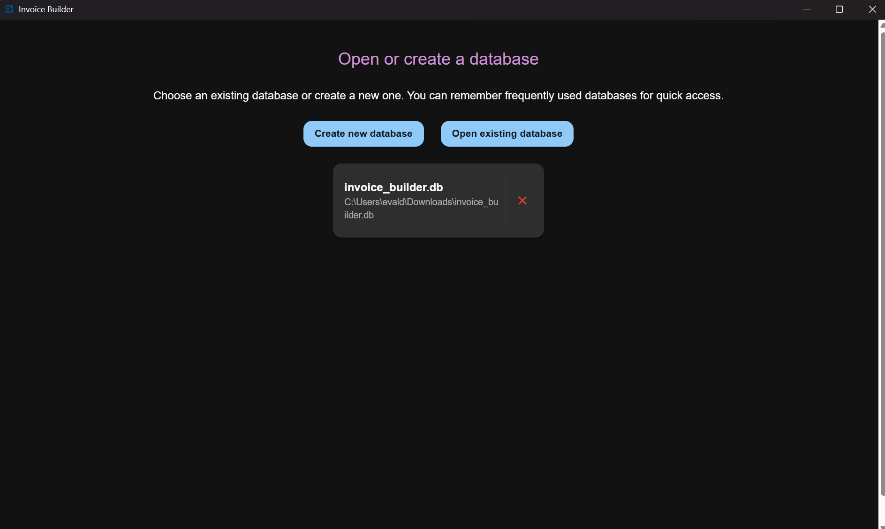
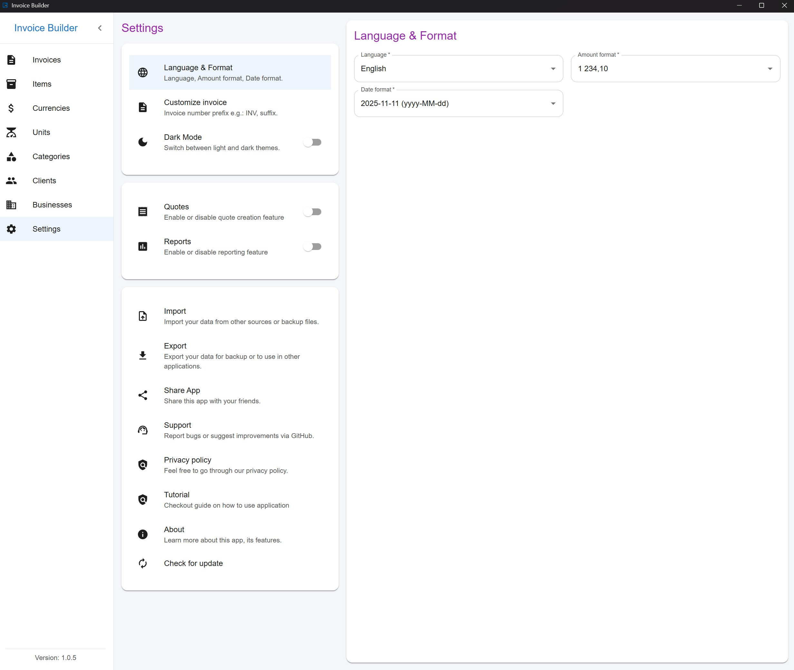
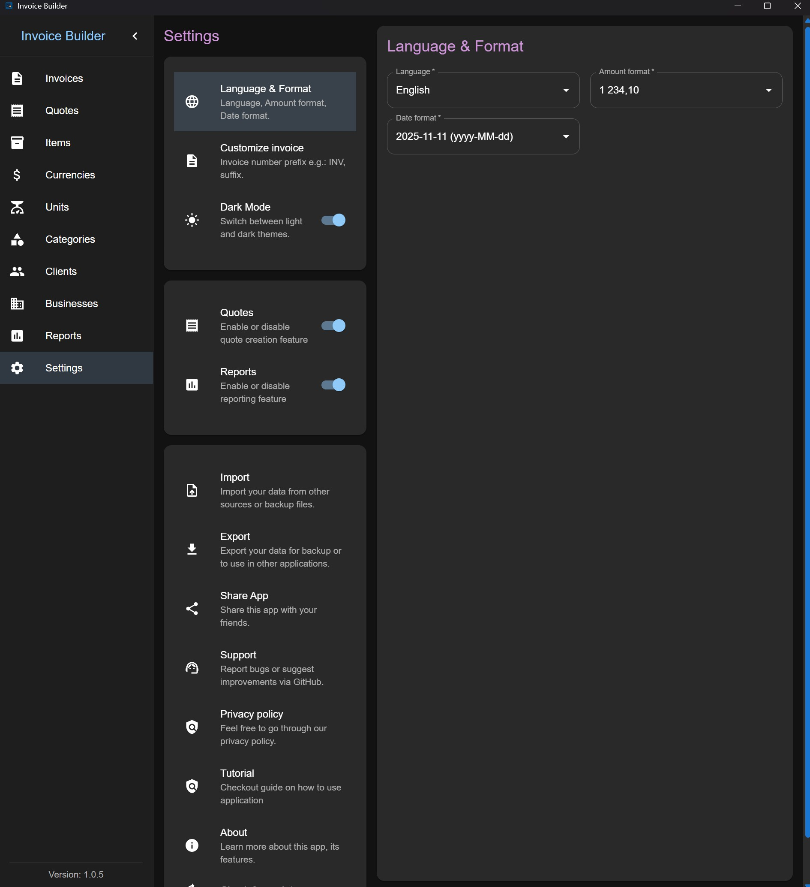
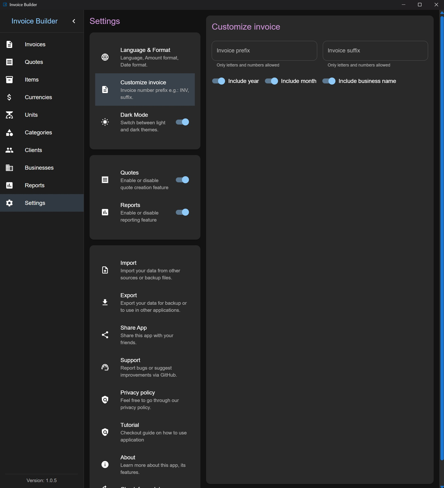
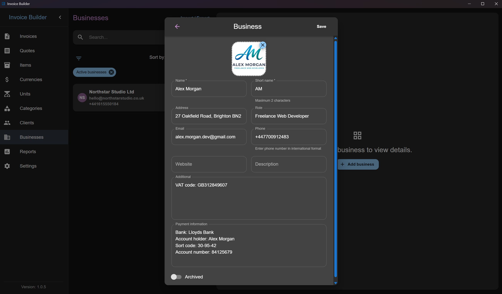
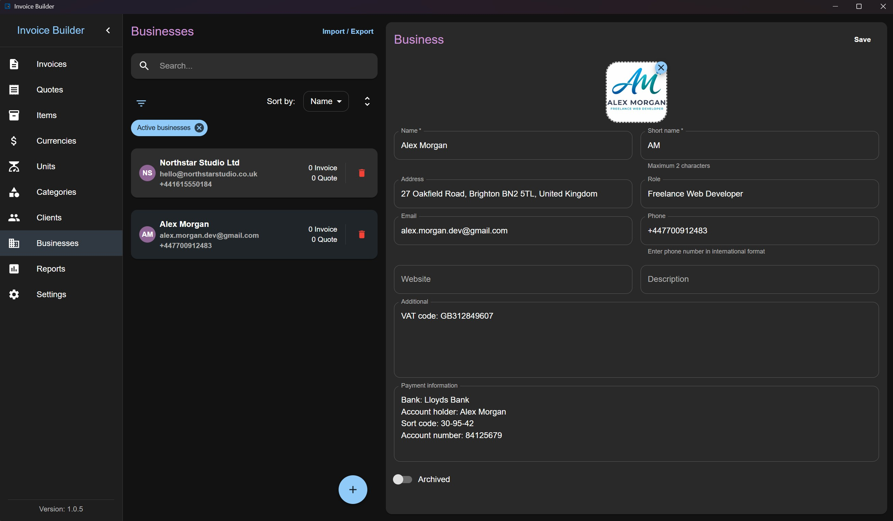
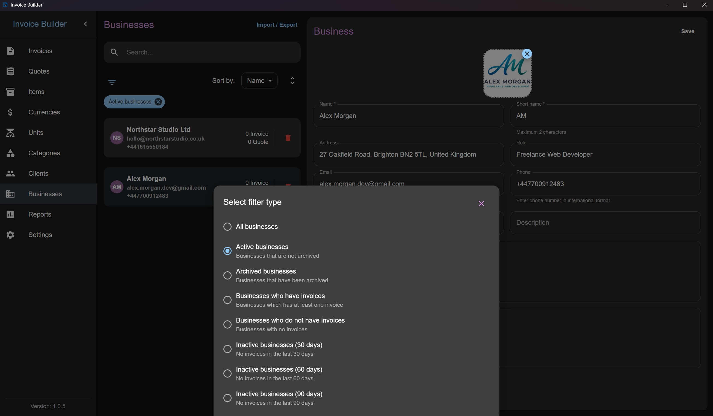
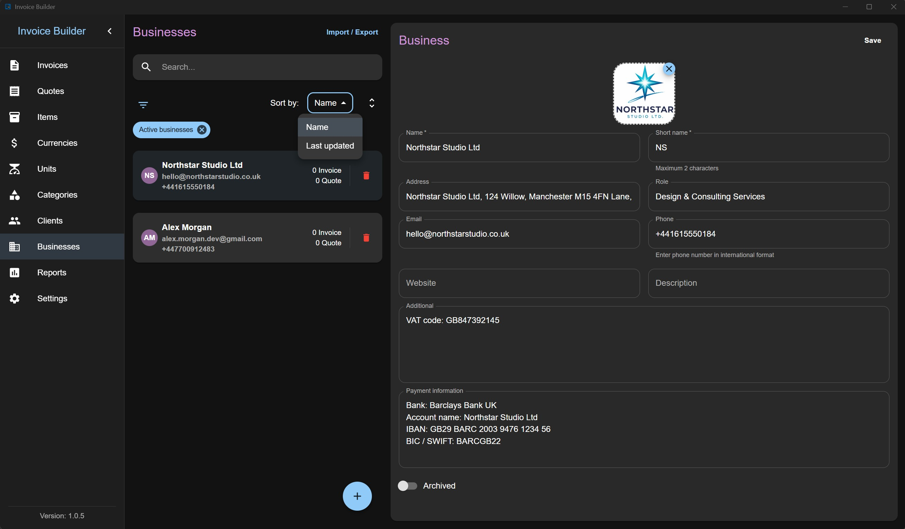
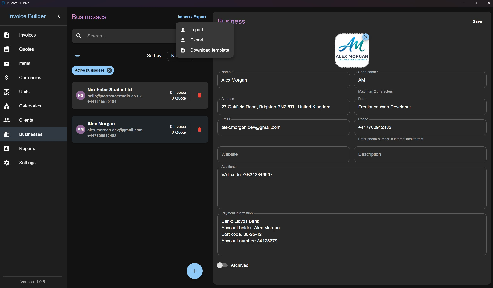

# Invoice Builder Tutorial

> 💡 **Note:** The interface is fully responsive and works well on resizable windows, making it suitable for users on Linux tiling window managers, small screens, or any desktop setup.

## Database creation screen

The first screen of the application allows you to **create a new database** at a chosen location or **open an existing one**.

Recently opened databases are displayed in a **quick access list** for faster reopening.

## Settings screen

The **Settings** screen allows you to configure application behavior, manage data, and customize document output.

### General & Data Management

From this screen you can:

- Enable or disable optional layouts (**Quotes** and **Reports**)
- Export all application data to **JSON**
- Import previously exported data
- Access project resources:
  - GitHub repository
  - Issue tracker
  - Tutorial
  - Project homepage
  - Privacy Policy
  - Terms of Use
- Check for application updates via GitHub Releases

### Localization & Formatting

You can customize:

- Application language
- Number (amount) formatting
- Date formatting

### Invoice & File Naming

The following options are available:

- Customize invoice and quote numbers using:
  - Prefix
  - Suffix
- Customize exported PDF file names

By default, files are named: "{Invoice|Quote}\_{InvoiceNumber}.pdf"

You can optionally include:

- Year
- Month
- Business name

## Businesses screen

The **Businesses** screen allows you to **create, read, update, and delete (CRUD)** business data. You can also **filter**, **import**, and **export** businesses via XLSX.

### Adding a Business

Click the **Add** button at the bottom to open a modal where you can:

- Enter business information
- Upload a logo (crop and adjust as needed)

### Editing a Business

Once businesses are added, select one from the list to edit it on the right side. Each business item also shows:

- Number of invoices created
- Number of quotes created (hidden if the layout is disabled in settings)

You can also **search businesses by name**.

### Filters

Businesses have filters to control what is displayed. By default:

- **Active**: shows all businesses except archived

The **archived flag** can be toggled during creation or editing. This flag only affects filtering and does not delete the business.

### Sorting

Businesses can be sorted by:

- Name
- Last updated date

### Import & Export

You can:

- Export businesses to XLSX
- Import businesses from XLSX
- Download a XLSX template for business import

